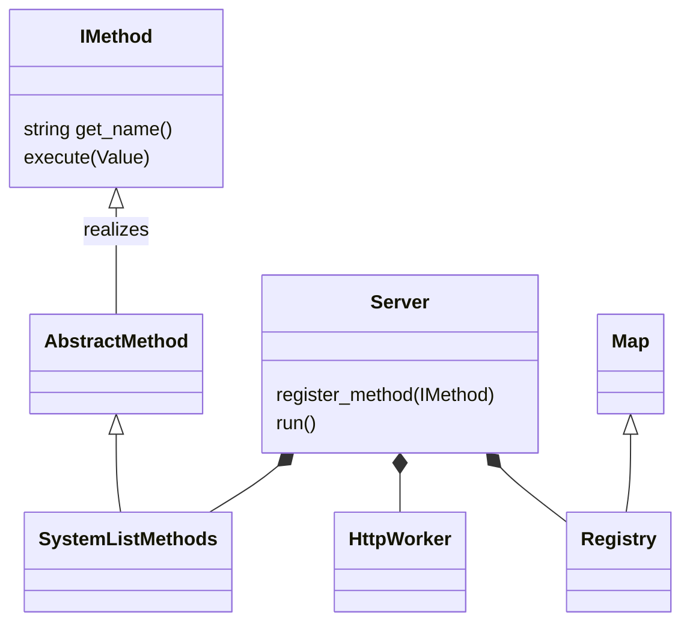
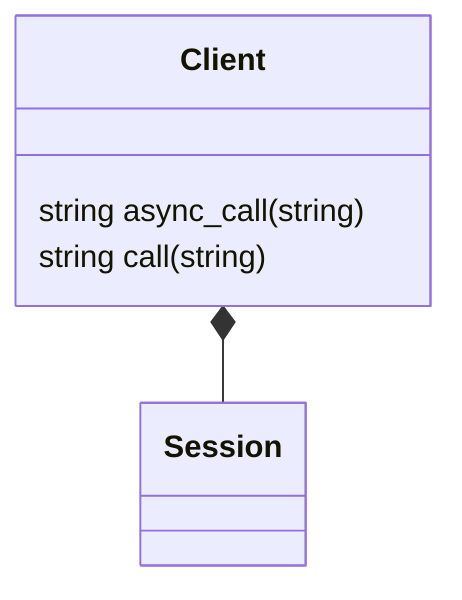
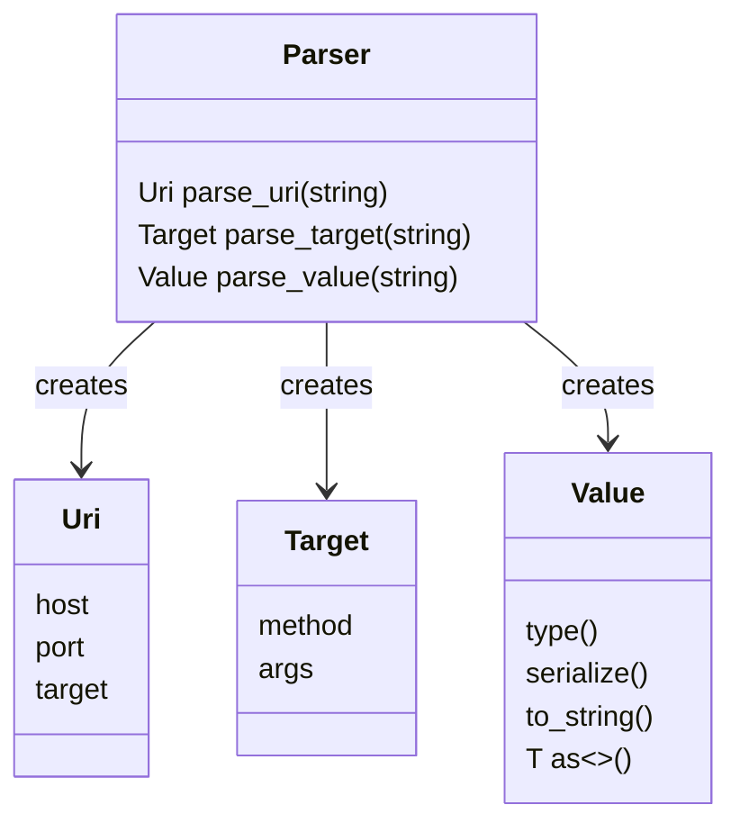
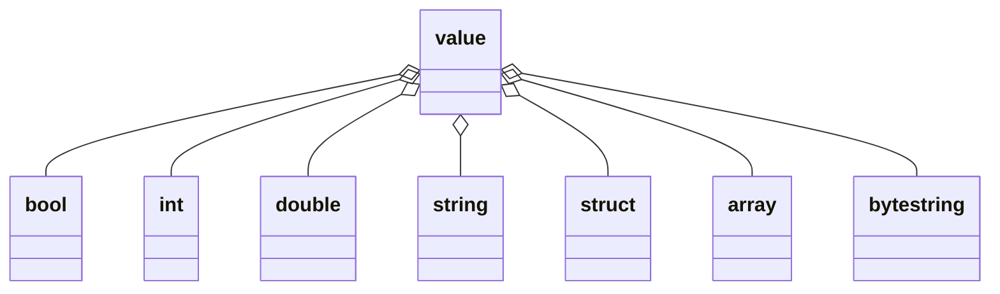
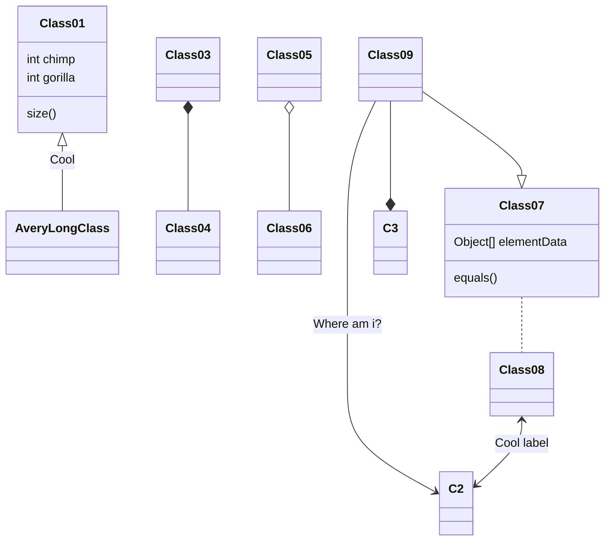

# WebRPC Software Structure

## Server Classes

```mermaid
classDiagram
IMethod <|-- AbstractMethod : realizes
Map <|-- Registry
Server *-- HttpWorker
Server *-- SystemListMethods
Server *-- Registry
AbstractMethod <|-- SystemListMethods
IMethod : string get_name()
IMethod : execute(Value)
Server : register_method(IMethod)
Server : run()
```

## Client Classes

```mermaid
classDiagram
Client *-- Session
Client : string async_call(string)
Client : string call(string)
```

## Data Classes

```mermaid
classDiagram
Parser --> Uri : creates
Parser --> Target : creates
Parser --> Value : creates
Parser : Uri parse_uri(string)
Parser : Target parse_target(string)
Parser : Value parse_value(string)
Target : method
Target : args
Uri : host
Uri : port
Uri : target
Value : type()
Value : serialize()
Value : to_string()
Value : T as<>()
```

```mermaid
classDiagram
value o-- bool
value o-- int
value o-- double
value o-- string
value o-- struct
value o-- array
value o-- bytestring
```

## Mermaid Sample

```mermaid
classDiagram
Class01 <|-- AveryLongClass : Cool
Class03 *-- Class04
Class05 o-- Class06
Class07 .. Class08
Class09 --> C2 : Where am i?
Class09 --* C3
Class09 --|> Class07
Class07 : equals()
Class07 : Object[] elementData
Class01 : size()
Class01 : int chimp
Class01 : int gorilla
Class08 <--> C2: Cool label
```

